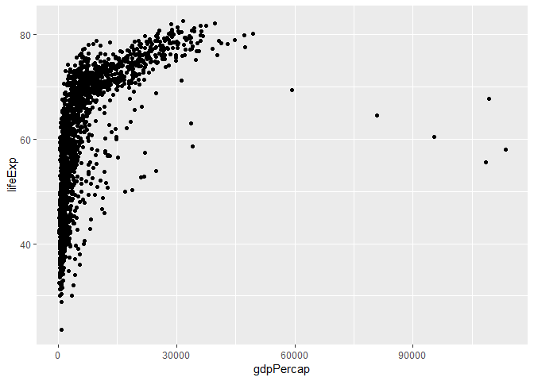
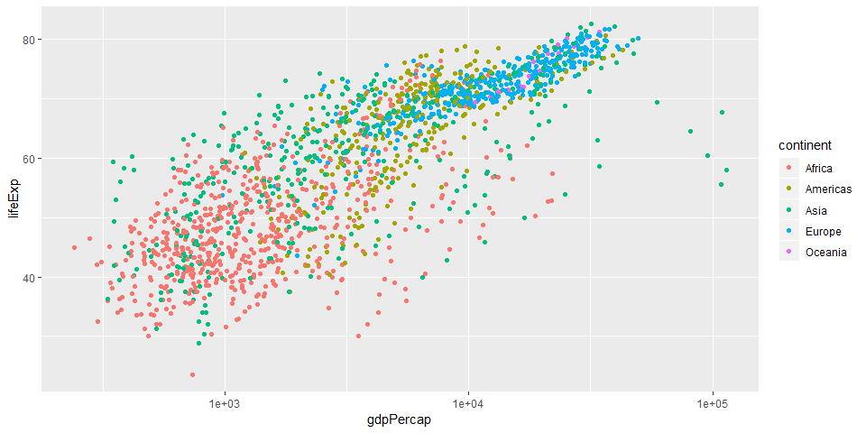

# Introduction
 
change "html_document" to "pdf_document", after latex installation
Here's my first rmd document
table of content (toc) start with "#"

# Let's embed some R code

We'll write an R chunk that loads the tidyverse package and then read in the gapminder data set, use the back tip near "1" or ctrl+alt+i

```r
library(tidyverse)
```

```
## -- Attaching packages ----------------------------------------------------- tidyverse 1.2.1 --
```

```
## v ggplot2 3.0.0     v purrr   0.2.5
## v tibble  1.4.2     v dplyr   0.7.6
## v tidyr   0.8.1     v stringr 1.3.0
## v readr   1.1.1     v forcats 0.3.0
```

```
## -- Conflicts -------------------------------------------------------- tidyverse_conflicts() --
## x dplyr::filter() masks stats::filter()
## x dplyr::lag()    masks stats::lag()
```

```r
gm<- read.csv("gapminder.csv")
```

#investigate gm data
let's take a look at GM


```r
head(gm)
```

```
##       country continent year lifeExp      pop gdpPercap
## 1 Afghanistan      Asia 1952  28.801  8425333  779.4453
## 2 Afghanistan      Asia 1957  30.332  9240934  820.8530
## 3 Afghanistan      Asia 1962  31.997 10267083  853.1007
## 4 Afghanistan      Asia 1967  34.020 11537966  836.1971
## 5 Afghanistan      Asia 1972  36.088 13079460  739.9811
## 6 Afghanistan      Asia 1977  38.438 14880372  786.1134
```

#Our first plot

showing gdp per capia on x and life exp on y


```r
ggplot(gm, aes(x=gdpPercap, y=lifeExp))+geom_point()
```



#A better plot


```r
ggplot(gm, aes(x=gdpPercap, y=lifeExp))+geom_point(aes(col=continent))+scale_x_log10()
```


#possible chunk options
https://yihui.name/knitr/options/
options include: 
-echo (true by default, whether to include code in output)
-results
  -hide (hide the results)
  -hold (hold the result until end of chunk)
-include (true by default, if false then the code will not be run)
-fig.width, fig.height 
-cache (false by default) if true, will only re-run the code if any changes. result will be cached


```r
ggplot(gm, aes(x=gdpPercap, y=lifeExp))+geom_point(aes(col=continent))+scale_x_log10()
```




#table in RMarkdown
see some data using head

```r
head(gm)
```

```
##       country continent year lifeExp      pop gdpPercap
## 1 Afghanistan      Asia 1952  28.801  8425333  779.4453
## 2 Afghanistan      Asia 1957  30.332  9240934  820.8530
## 3 Afghanistan      Asia 1962  31.997 10267083  853.1007
## 4 Afghanistan      Asia 1967  34.020 11537966  836.1971
## 5 Afghanistan      Asia 1972  36.088 13079460  739.9811
## 6 Afghanistan      Asia 1977  38.438 14880372  786.1134
```
now head function as a nicely formatted table


```r
library(knitr)
kable(head(gm))
```


country       continent    year   lifeExp        pop   gdpPercap
------------  ----------  -----  --------  ---------  ----------
Afghanistan   Asia         1952    28.801    8425333    779.4453
Afghanistan   Asia         1957    30.332    9240934    820.8530
Afghanistan   Asia         1962    31.997   10267083    853.1007
Afghanistan   Asia         1967    34.020   11537966    836.1971
Afghanistan   Asia         1972    36.088   13079460    739.9811
Afghanistan   Asia         1977    38.438   14880372    786.1134

